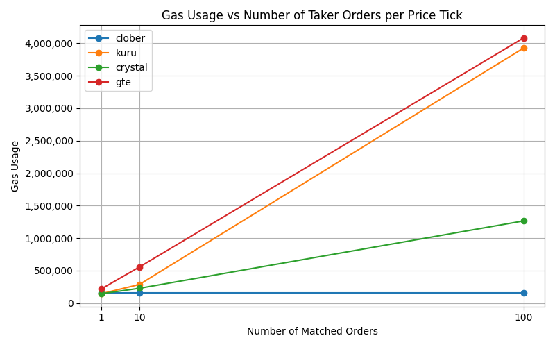

# Gas Usage Benchmark for Take Operations

This benchmark measures the gas usage when taking multiple orders in a single tick across different DEX implementations.

## 📊 Results

Gas usage for **take operations** after placing `N` orders in the same tick:

| DEX     | N = 1   | N = 10  | N = 100  |
|---------|---------|---------|----------|
| Clober  | 153,941 | 153,941 | 153,941  |
| Crystal | 143,854 | 228,627 | 1,264,872|
| Kuru    | 143,738 | 287,695 | 3,925,232|



> All values represent total gas used during a take operation after placing `N` limit orders in the same tick.

## 🚀 How to Run

1. Install dependencies:

```bash
bun i
```

2. Run benchmark with desired order count:

```bash
N=100 bun run index.ts
```

Replace `100` with any number to test with a different number of orders.

3. View results:

```bash
python plot_take_results.py
```

## 🧪 Description

This benchmark script:

- Places `N` limit orders in the same tick on each DEX
- Executes a single `take` operation
- Measures the total gas used
- Stores results in `results/{dex}-take-{N}.json`

## 📁 Output Structure

The output files are saved as JSON in the `results/` directory:

```
results/
├── clober-take-1.json
├── clober-take-10.json
├── clober-take-100.json
├── ...
```

Each file looks like this:

```json
{
  "alias": "clober-take-100",
  "gasUsage": "153941"
}
```